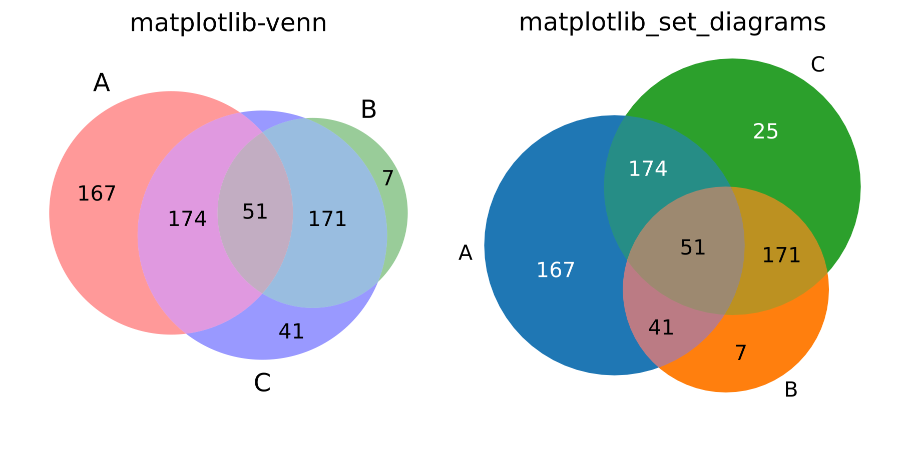

# Matplotlib Set Diagrams

*Draw Euler diagrams and Venn diagrams with Matplotlib.*

[Euler](https://en.wikipedia.org/wiki/Euler_diagram) and [Venn](https://en.wikipedia.org/wiki/Venn_diagram) diagrams are used to visualise the relationships between sets. Both typically employ circles to represent sets, and areas where two circles overlap represent subsets common to both supersets.
Venn diagrams show all possible relationships of inclusion and exclusion between two or more sets.
In Euler diagrams, the area corresponding to each subset is scaled according to the size of the subset. If a subset doesn't exist, the corresponding area doesn't exist.


## Installation

``` shell
pip install matplotlib_set_diagrams
```


## Documentation

Numerous tutorials, code examples, and a complete documentation of the API can be found on [ReadTheDocs](https://matplotlib_set_diagrams.readthedocs.io/en/latest/index.html).


## Quickstart

This section is for the impatient. For more comprehensive, step-by-step guides, please consult the [documentation](https://matplotlib_set_diagrams.readthedocs.io/en/latest/sphinx_gallery_output/index.html).

``` python
import matplotlib.pyplot as plt

from matplotlib_set_diagrams import EulerDiagram, VennDiagram

fig, axes = plt.subplots(2, 4, figsize=(15, 5))

for ii, SetDiagram in enumerate([EulerDiagram, VennDiagram]):

    # Initialise from a list of sets:
    SetDiagram.from_sets(
        [
            {"a", "b", "c", "d", "e"},
            {"e", "f", "g"},
        ],
        ax=axes[ii, 0])

    # Alternatively, initialise directly from pre-computed subset sizes.
    SetDiagram(
        {
            (1, 0) : 4, # {"a", "b", "c", "d"}
            (0, 1) : 2, # {"f", "g"}
            (1, 1) : 1, # {"e"}
        },
        ax=axes[ii, 1])

    # Visualise subset items as word clouds:
    text_1 = """Lorem ipsum dolor sit amet, consectetur adipiscing elit,
    sed do eiusmod tempor incididunt ut labore et dolore magna aliqua. Ut
    enim ad minim veniam, quis nostrud exercitation ullamco laboris nisi
    ut aliquip ex ea commodo consequat."""

    text_2 = """Duis aute irure dolor in reprehenderit in voluptate velit
    esse cillum dolore eu fugiat nulla pariatur. Lorem ipsum dolor sit
    amet."""

    def word_tokenize(text):
        """Break a string into its constituent words, and convert the words
        into their 'standard' form (tokens).

        The procedure below is a poor-man's tokenization.
        Consider using the Natural Language Toolkit (NLTK) instead:

        >>> import nltk; words = nltk.word_tokenize(text)

        """
        # get a word list
        words = text.split(' ')
        # remove non alphanumeric characters
        words = [''.join(ch for ch in word if ch.isalnum()) for word in words]
        # convert to all lower case
        words = [word.lower() for word in words]
        return words

    # Tokenize strings.
    sets = [set(word_tokenize(text)) for text in [text_1, text_2]]

    SetDiagram.as_wordcloud(sets, ax=axes[ii, 2])

    # The implementation generalises to any number of sets.
    # However, exact solutions are only guaranteed for two given sets,
    # and the more sets are given, the less likely it becomes that
    # the optimisation procedure finds even an approximate solution.
    # Furthermore, above four or five sets, diagrams become unintelligible.
    # Here an example of a 4-way set diagram:
    SetDiagram(
        {
            (1, 0, 0, 0) : 4.0,
            (0, 1, 0, 0) : 3.0,
            (0, 0, 1, 0) : 2.0,
            (0, 0, 0, 1) : 1.0,
            (1, 1, 0, 0) : 0.9,
            (1, 0, 1, 0) : 0.8,
            (1, 0, 0, 1) : 0.7,
            (0, 1, 1, 0) : 0.6,
            (0, 1, 0, 1) : 0.5,
            (0, 0, 1, 1) : 0.4,
            (1, 1, 1, 0) : 0.3,
            (1, 1, 0, 1) : 0.25,
            (1, 0, 1, 1) : 0.2,
            (0, 1, 1, 1) : 0.15,
            (1, 1, 1, 1) : 0.1,
        },
    ax=axes[ii, 3])

    # set row titles
    axes[ii, 0].annotate(
        SetDiagram.__name__,
        xy         = (0, 0.5),
        xycoords   = 'axes fraction',
        xytext     = (-10, 0),
        textcoords = "offset points",
        ha         = 'right',
        va         = 'center',
        fontsize   = 'large',
        fontweight = 'bold',
    )

fig.tight_layout()
plt.show()

```


## Alternative python libraries

[`matplotlib-venn`](https://github.com/konstantint/matplotlib-venn/): the inspiration for this library. However, `matplotlib-venn` has some significant drawbacks:

1. [It only produces two-way and three-way set diagrams.](https://github.com/konstantint/matplotlib-venn/issues/15)
2. [There is no support for visualising set contents](https://github.com/konstantint/matplotlib-venn/issues/41) other than external libraries such as my [matplotlib_venn_wordcloud](https://github.com/paulbrodersen/matplotlib_venn_wordcloud).
3. The layout engine often generates incorrect results for three-way set diagrams, and a lot of issues on the matplotlib-venn issue tracker boil down to this problem. Consider the example below, [adapted from issue #34](https://github.com/konstantint/matplotlib-venn/issues/34):

  - Subset (1, 0, 0) / abC / (A - B - C) is annotated with the label for subset (1, 1, 0) / ABc / (A & B - C).
  - Subset (1, 1, 0) / ABc / (A & B - C) is not visualised at all.



``` python
import matplotlib.pyplot as plt

from matplotlib_set_diagrams import EulerDiagram
from matplotlib_venn import venn3

fig, axes = plt.subplots(1, 2, figsize=(6, 3))

subset_sizes = {
    (1, 0, 0) : 167, # Abc in matplotlib-venn nomenclature
    (0, 1, 0) : 7,   # aBc
    (0, 0, 1) : 25,  # abC
    (1, 1, 0) : 41,  # ABc
    (0, 1, 1) : 174, # aBC
    (1, 0, 1) : 171, # AbC
    (1, 1, 1) : 51,  # ABC
}

axes[0].set_title("matplotlib-venn")
print(tuple(subset_sizes.values()))
# (167, 7, 25, 41, 174, 171, 51)
venn3(tuple(subset_sizes.values()), ax=axes[0])

axes[1].set_title("matplotlib_set_diagrams")
EulerDiagram(subset_sizes, ax=axes[1])

plt.show()
```

[`pyvenn`](https://github.com/tctianchi/pyvenn): Uses pre-built images to produce Venn diagrams for up to 6 sets. The visualisations are hence not area-proportional; only the subset labels are adjusted based on user input.


[`supervenn`](https://github.com/gecko984/supervenn): Produces area-proportional, Euler diagram-equivalent visualisations, that are, however, not Euler or Venn diagrams. Generalises well to arbitrary numbers of sets and thus easily the superior choice for diagnostic purposes (its intended use-case). However, the produced visualisations are more difficult to communicate to the unfamiliar reader, and thus probably less appropriate for publications.


``` python
from supervenn import supervenn

sets = [{1, 2, 3, 4}, {3, 4, 5}, {1, 6, 7, 8}]
labels = ['alice', 'bob', 'third party']
supervenn(sets, labels)
plt.show()
```

## Contributing & Support

If you get stuck and have a question that is not covered in the documentation, please raise an issue on the issue tracker](https://github.com/paulbrodersen/matplotlib_set_diagrams/issues).
If applicable, make a sketch of the desired result.
If you submit a bug report, please make sure to include the complete error trace. Include any relevant code and data in a [minimal, reproducible example](https://stackoverflow.com/help/minimal-reproducible-example).
Pull requests are always welcome.
